= Tourist Mobile Application — Solution Design
:toc: left
:toclevels: 3
:numbered:
:icons: font
:sectanchors:

== Executive Summary

A mobile tourist application that uses AI-powered photo recognition to identify attractions and provide descriptions via text and audio. The platform connects tourists with signed partner businesses for monetization through commissions, advertising, and loyalty programs.

This document presents **4 architecture options** ranging from a lean MVP ($240k) to enterprise-scale platform ($3.53M), with a recommendation for **Option 2: Progressive Build** as the best balance of cost, risk, and market coverage.

=== Key Decision: Why Option 2

[cols="1,3"]
|===
|Criteria |Rationale

|**Cost-effective**
|$532k CAPEX covers POC through full features — 3× less than Option 3

|**Progressive de-risking**
|Validates core AI recognition in POC before committing to payments + multi-region

|**US + China from Day 1**
|Opens both major tourist markets; China adds only ~$100k vs Option 1

|**Clear migration path**
|Modular monolith boundaries enable future microservices extraction (Option 3/4)

|**Manageable team**
|4→6 developers avoids coordination overhead of larger teams
|===

---

== Problem Statement

=== Current User Pain Point

Tourists currently follow this flow to learn about attractions:

. Take a photo of an attraction
. Open ChatGPT or Wikipedia
. Manually search for information
. Read/listen separately
. Search again for nearby restaurants, cafes, activities

This is fragmented, slow, and has no monetization path.

=== Proposed Solution

A single mobile app that replaces the entire flow:

. User photographs an attraction
. AI identifies the attraction (95% target accuracy)
. App delivers a text + audio description
. App recommends signed partner businesses nearby
. User receives QR-code discounts at partners
. Loyalty program incentivizes repeat usage

=== Business Model

* **Partner commissions**: 10-20% on transactions facilitated through the app
* **Partner advertising**: Promoted placement in recommendation results
* **Scale ambition**: Klook/Viator level (50M+ users) over 3-5 years

== Architecture Options Overview

Four options are presented, each building on the previous:

[cols="1,2,1,1,1,1"]
|===
|Option |Description |CAPEX |OPEX/mo |Timeline |Regions

|**1: MVP**
|Core AI + partners, US only
|$240k
|$835
|4 months
|US

|**2: Progressive** ⭐
|MVP → Payments + Loyalty + China
|$532k
|$2,630
|7 months
|US + China

|**3: All Features**
|Complete platform, Day 1
|$1.65M
|$6,550
|10 months
|US + China + EU

|**4: Klook Scale**
|Migration to enterprise scale
|$3.53M
|$74,800
|12 months
|Global (5 regions)
|===

.Cost Comparison
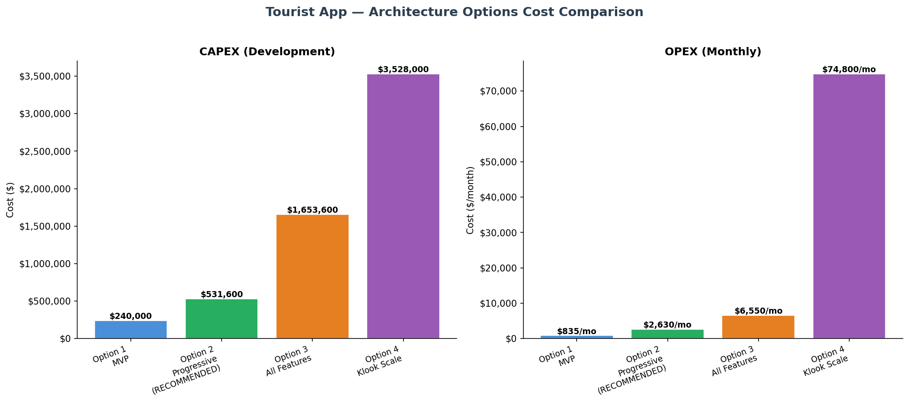

== Option 1: MVP — Validate the Core Concept

=== Overview

[cols="1,3"]
|===
|Timeline |4 months (Mar–Jun 2026)
|CAPEX |$240,000 (incl. 25% risk buffer)
|OPEX |$835/month (Year 1, ~1k users)
|Team |4 developers, 2 streams
|Region |US only (us-east-1)
|Architecture |Modular monolith + isolated AR microservice
|===

=== What It Delivers

* Photo recognition with multi-provider AI fallback (Google Vision → GPT-4V → Gemini)
* Attraction descriptions (text + audio via TTS)
* Partner recommendations based on geolocation (PostGIS)
* User accounts (Cognito — social login + email/password)
* QR code discount system
* Offline caching of visited attractions

=== What It Doesn't

* No payment processing
* No loyalty program
* No multi-region deployment
* No partner self-service portal
* No multi-language support

=== Architecture

.Option 1 Architecture Diagram
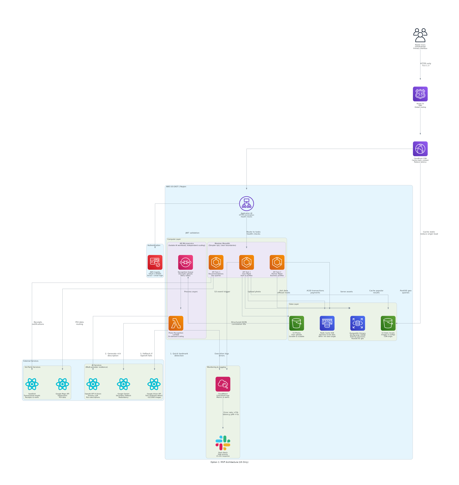

Key components:

* **3 ECS Fargate tasks** — modular monolith with clear domain boundaries (Users, Partners, Content)
* **1 Lambda function** — AI photo recognition pipeline, decoupled via SQS
* **PostgreSQL** (db.t4g.large) with PostGIS for geolocation queries
* **Redis** (5GB) for session + hot data caching
* **S3** for photo storage
* **CloudFront CDN** for US distribution

=== Cost Breakdown

.Option 1 CAPEX
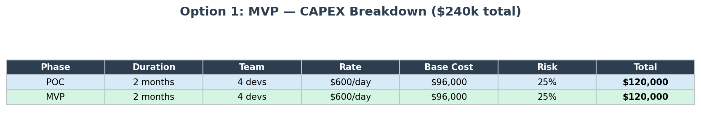

.Option 1 Monthly OPEX
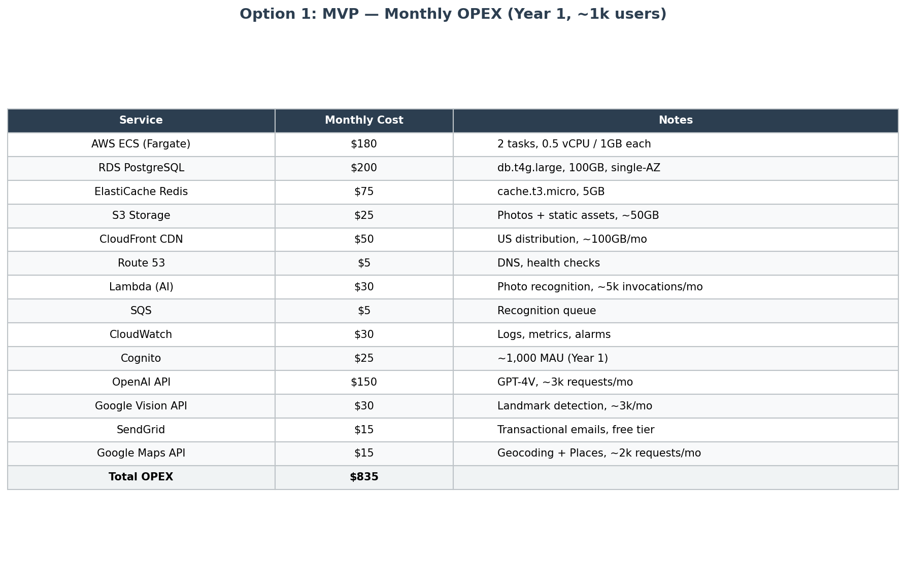

=== Timeline

.Option 1 Development Timeline
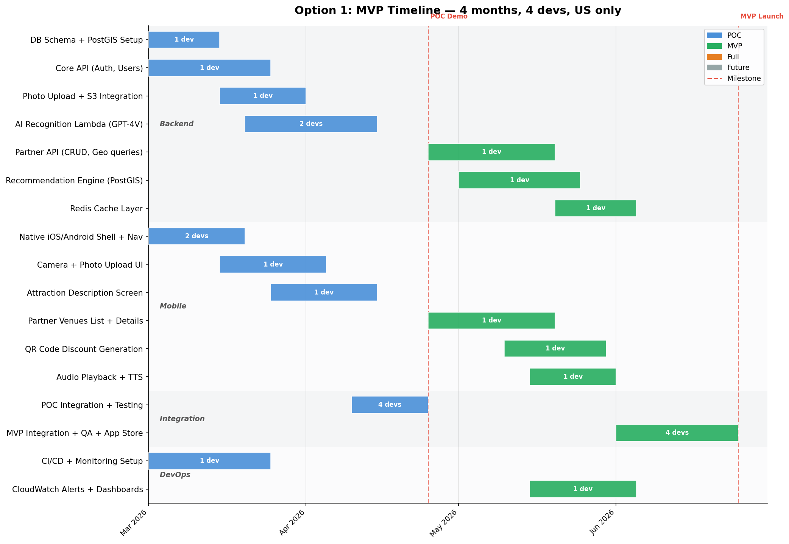

**Work Streams:**

[cols="1,1,3"]
|===
|Stream |Team |Focus

|Backend
|2 devs
|DB schema, APIs, photo upload pipeline, AI Lambda

|Mobile (Native)
|2 devs
|iOS (Swift) + Android (Kotlin) shells, camera, UI

|DevOps
|Shared
|CI/CD, CloudWatch, production setup
|===

=== Risk Assessment

Risk buffer: **25%** — justified by:

* Well-known AWS stack (ECS, PostgreSQL, S3)
* Single region — no multi-region complexity
* Clear, limited scope
* Team of 4 is manageable communication-wise

== Option 2: Progressive Build — RECOMMENDED ⭐

=== Overview

[cols="1,3"]
|===
|Timeline |7 months (Mar–Sep 2026), MVP at Month 4
|CAPEX |$532,000 (incl. 25-35% risk buffer)
|OPEX |$2,630/month (Year 2, ~10k users)
|Team |4 developers (POC/MVP) → 6 developers (Full), 3 streams
|Regions |US (us-east-1) + China (cn-north-1)
|Architecture |Modular monolith + Lambda services + China mirror
|===

=== What It Delivers (Beyond Option 1)

**Phase 1 — POC + MVP (Months 1-4):** Everything in Option 1, plus:

* Multi-region architecture validated in POC
* US production deployment

**Phase 2 — Full Features (Months 5-7):**

* **Stripe payment integration** (PCI-DSS compliant) for ticket/tour purchases
* **Loyalty points engine** — earn/redeem points, QR-based partner discounts
* **China deployment** — Alibaba CDN for Great Firewall, separate data residency
* **Cross-region replication** — eventual consistency, RPO 15 min
* **Multi-language support** — English, Chinese, Spanish
* **Offline mode enhanced** — on-device ML model for basic recognition (70-80% accuracy)

=== Why This Option Is Recommended

. **Progressive de-risking**: POC validates AI + architecture before investing in payments and China
. **Cost-effective China expansion**: Adding cn-north-1 costs ~$100k more than Option 1 but opens China's massive tourist market
. **Monetization-ready**: Stripe payments + loyalty program create revenue streams from Month 4+ (MVP)
. **Architecture migration path**: Modular monolith with clear boundaries enables extraction to microservices (Option 3/4) when traffic demands it
. **Manageable team scaling**: 4→6 devs avoids the coordination overhead of Options 3/4

=== Architecture

.Option 2 Architecture Diagram
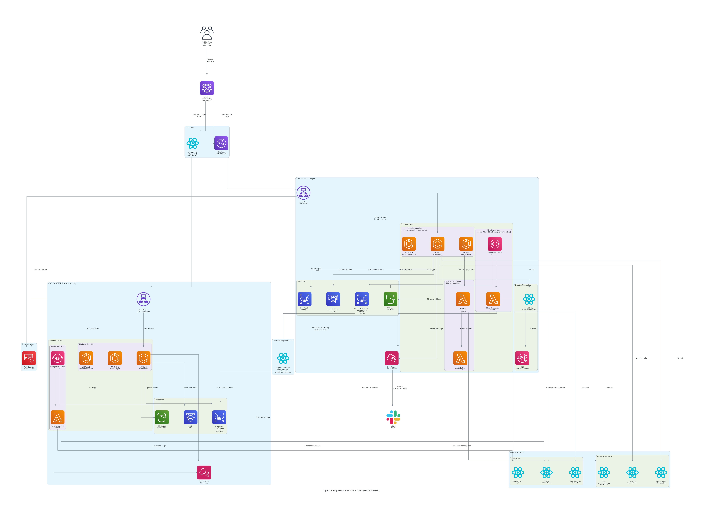

Key components added vs Option 1:

* **Dual-region ECS** (3 tasks × 2 regions)
* **Lambda payment + loyalty services** — isolated for PCI compliance
* **PostgreSQL per region** (db.t4g.xlarge, 500GB) with US read replica
* **Alibaba CDN** for China content delivery behind Great Firewall
* **EventBridge** for event-driven cross-service communication
* **SNS** for push notifications

=== Cost Breakdown

.Option 2 CAPEX
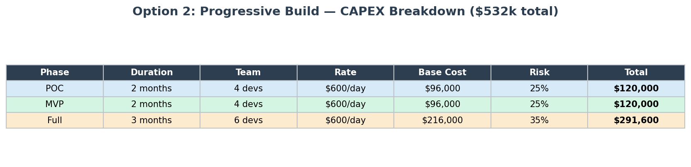

.Option 2 Monthly OPEX
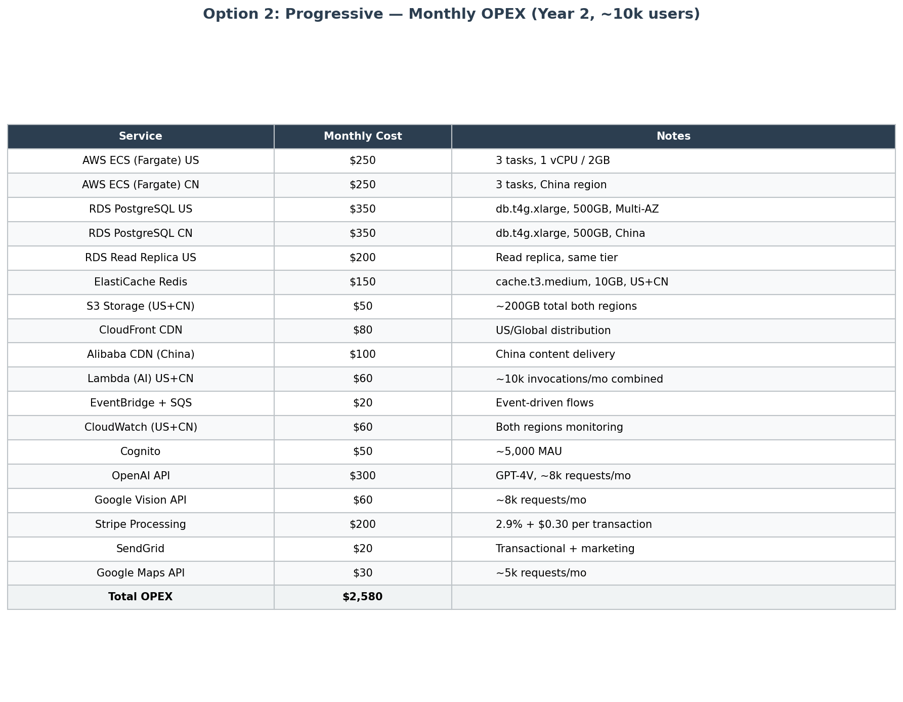

**Cost rationale:**

* POC: 4 devs × 2 months × $600/day = $96,000 base + 25% risk = $120,000
* MVP: 4 devs × 2 months × $600/day = $96,000 base + 25% risk = $120,000
* Full: 6 devs × 3 months × $600/day = $216,000 base + 35% risk = $291,600
* **Total: $531,600**
* Higher risk buffer (35%) on Full phase due to: China data residency complexity, Stripe PCI compliance, cross-region replication

=== Timeline

.Option 2 Development Timeline
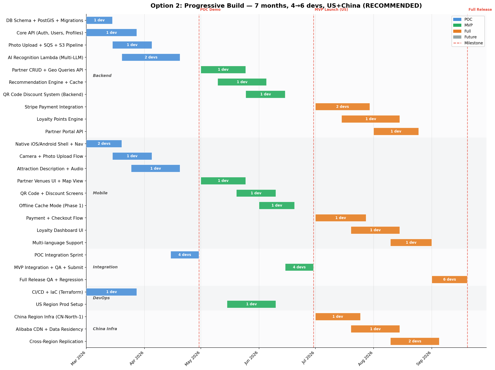

**Work Streams:**

[cols="1,1,1,3"]
|===
|Stream |Phase |Team |Focus

|Backend
|POC→Full
|2 devs
|DB schema + PostGIS, core APIs, photo pipeline, AI Lambda, payment integration, loyalty engine

|Mobile (Native)
|POC→Full
|2 devs
|iOS (Swift) + Android (Kotlin), camera, partner UI, payments, offline mode, multi-language

|China Infra
|Full
|2 devs (new)
|cn-north-1 setup, Alibaba CDN, data residency, cross-region replication

|DevOps
|POC→MVP
|Shared
|CI/CD (Terraform), US prod setup, monitoring
|===

=== Key Milestones

[cols="1,1,3"]
|===
|Milestone |Date |Gate Criteria

|**POC Demo**
|Apr 30, 2026
|AI recognition ≥90% accuracy, end-to-end photo→description flow working, <3s latency

|**MVP Launch (US)**
|Jun 30, 2026
|App Store submission, partner ecosystem with ≥10 partners, QR discounts functional

|**Full Release**
|Sep 20, 2026
|Payments live, loyalty program active, China region operational, multi-language support
|===

=== Risk Assessment

Risk buffer: **25% (POC/MVP) → 35% (Full)** — justified by:

* POC/MVP: Same stack as Option 1 + single region → 25%
* Full phase 35% because:
** China data residency laws require careful legal + technical compliance
** Stripe PCI-DSS certification process can take 2-4 weeks
** Cross-region DB replication requires extensive testing for consistency
** Team scaling from 4→6 devs has onboarding overhead

== Option 3: All Features Day 1

=== Overview

[cols="1,3"]
|===
|Timeline |10 months (Mar–Dec 2026)
|CAPEX |$1,654,000 (incl. 30-40% risk buffer)
|OPEX |$6,550/month (Year 2, ~50k users)
|Team |8→10 developers, 4 streams
|Regions |US + China active, EU prepared
|Architecture |Full microservices (5 ECS services) + polyglot persistence
|===

=== What It Adds Beyond Option 2

* **True microservices**: 5 independent ECS services (User, Partner, Recommendation, Payment, Loyalty)
* **API Gateway** as front door with throttling, rate limiting
* **OpenSearch** cluster for geo + full-text search
* **DynamoDB** for AR time-series logs
* **Kinesis + Redshift** analytics pipeline
* **WAF** for DDoS protection
* **KMS** encryption (AES-256) for data at rest
* **EU region** infrastructure prepared (not active)
* **Google Translate** for real-time multi-language

=== Architecture

.Option 3 Architecture Diagram
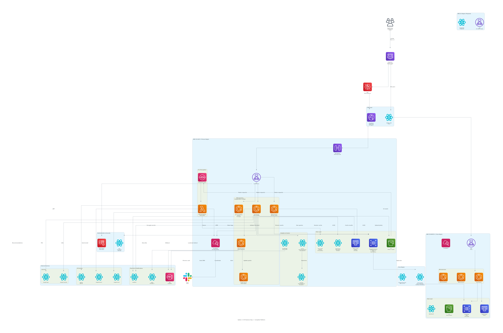

=== Cost Breakdown

.Option 3 CAPEX
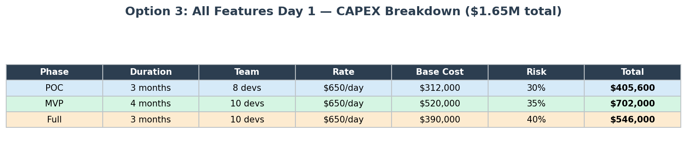

.Option 3 Monthly OPEX
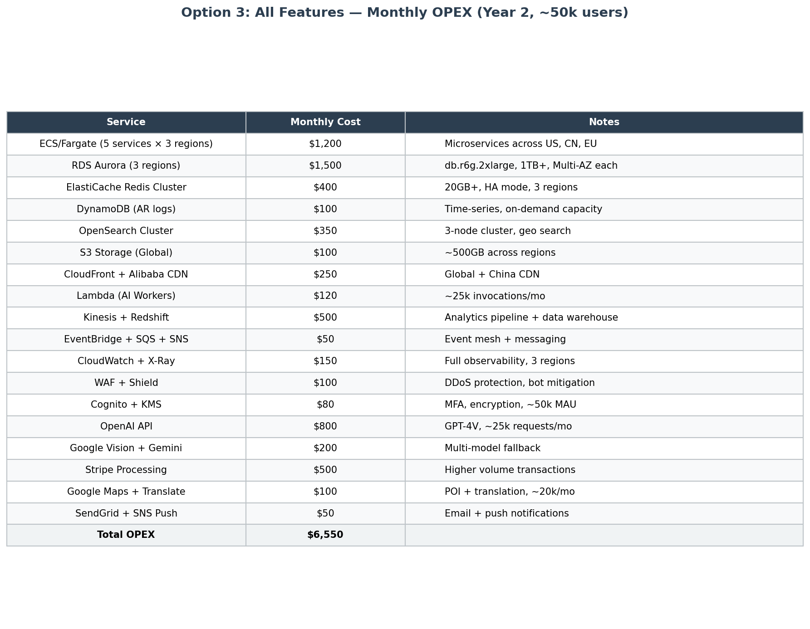

=== Timeline

.Option 3 Development Timeline
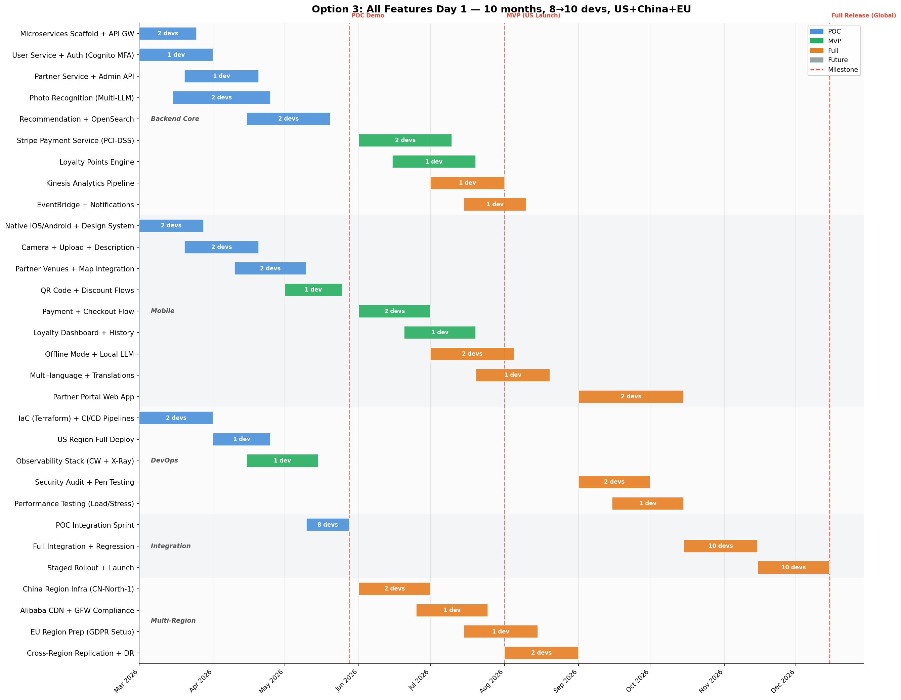

=== Trade-offs vs Option 2

[cols="1,1,1"]
|===
|Aspect |Advantage |Disadvantage

|Microservices
|Independent scaling, team autonomy
|3× more infrastructure, DevOps complexity

|Full analytics
|Business insights from Day 1
|Kinesis + Redshift = $500/mo before usage

|3 regions
|EU compliance ready
|EU region idle until traffic justifies it

|Larger team
|Faster parallel development
|More coordination overhead (30% vs 25%)
|===

=== Risk Assessment

Risk buffer: **30-40%** — justified by:

* Full microservices from Day 1 without incremental validation
* 3 simultaneous regions increase blast radius
* 10-person team coordination overhead
* Payment + loyalty + analytics all in parallel introduce multiple external vendor dependencies

== Option 4: Klook/Viator Scale

=== Overview

[cols="1,3"]
|===
|Timeline |12 months migration (assumes Option 2 or 3 running)
|CAPEX |$3,528,000 (incl. 35-45% risk buffer)
|OPEX |$74,800/month (Year 3+, 5M+ users)
|Team |15 developers, 5 streams
|Regions |Global: US×2, China, EU, APAC (5 active regions)
|Architecture |Kubernetes (EKS) + Istio service mesh + Aurora Global DB
|===

=== What It Adds Beyond Option 3

* **EKS + Istio** service mesh — 30+ microservices, canary deployments
* **Aurora Global DB** — 10+ shards, 50+ read replicas, 5 regions
* **SageMaker + GPU** workers for custom ML model training and serving
* **Kafka** for high-throughput event streaming (replacing SQS for scale)
* **DataDog APM** — distributed tracing, profiling across 50+ hosts
* **AWS Shield Advanced** — enterprise DDoS protection ($3k/mo base)
* **Active-active 5-region** deployment — US-East, US-West, China, EU, APAC
* **PayPal** as payment fallback alongside Stripe
* **Twilio** for global SMS notifications

=== Architecture

.Option 4 Architecture Diagram
image::../diagrams/option-4-scale-klook.png[Option 4 Architecture, align="center"]

=== Cost Breakdown

.Option 4 CAPEX
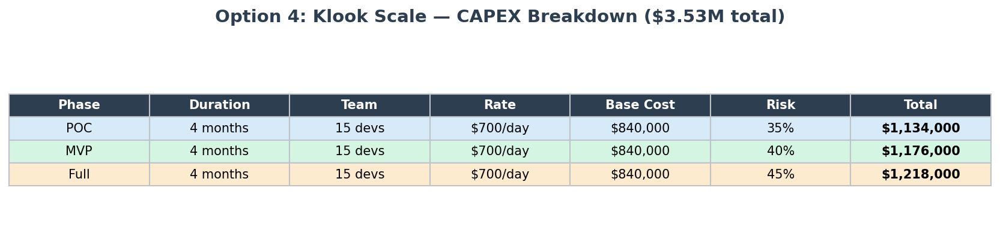

.Option 4 Monthly OPEX
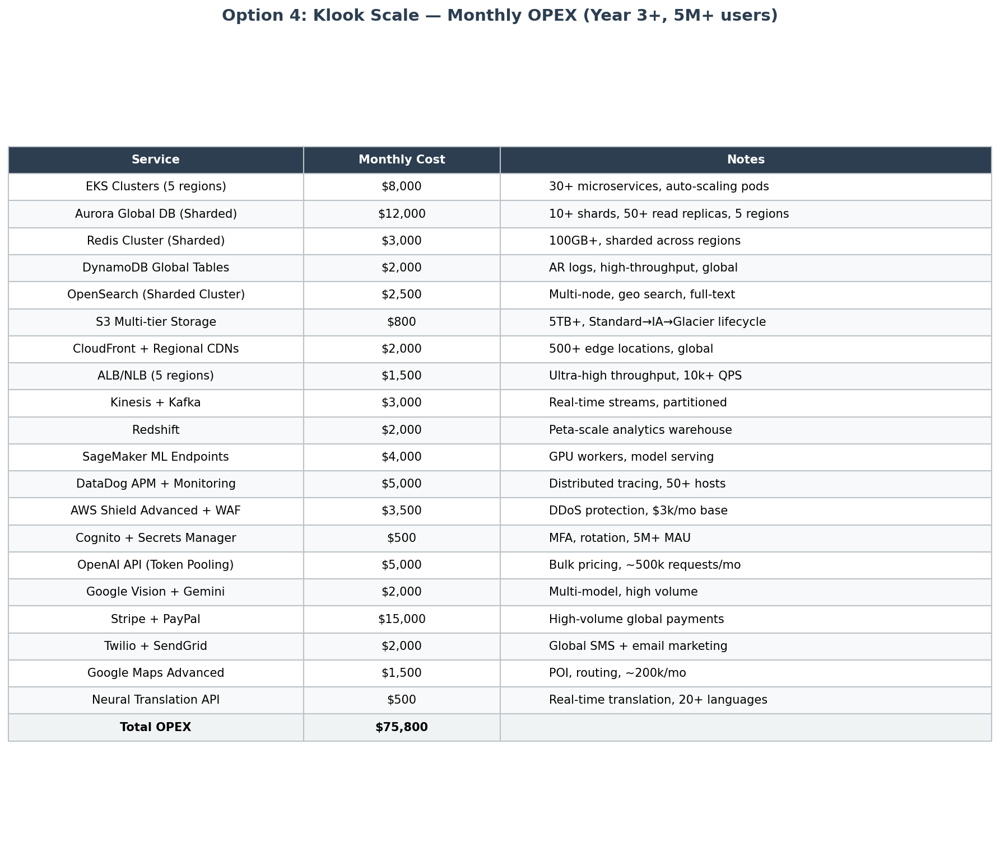

=== Timeline

.Option 4 Development Timeline
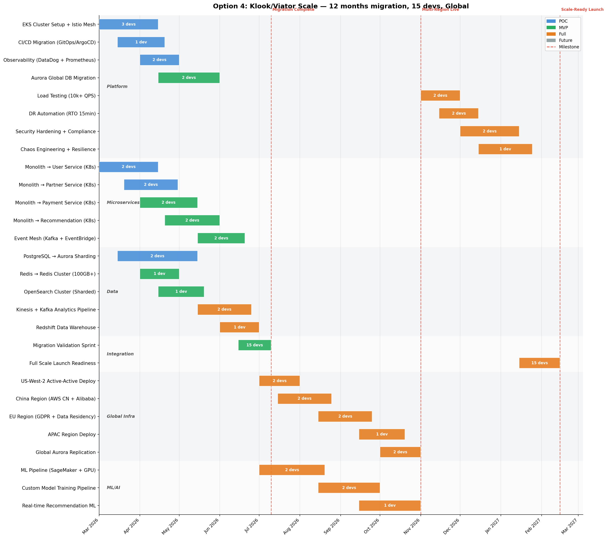

=== When to Choose Option 4

This is **not a starting point** — it's a migration target.  Trigger conditions:

* Active users exceed 100k+ and growing
* Database queries hitting performance limits despite indexing
* Monthly revenue justifies $74,800/mo infrastructure spend
* Team has grown to 15+ and needs microservices team boundaries
* Business requires ≥5-region active-active presence

== Technical Deep Dives

=== AI Recognition Strategy

The AI pipeline uses a multi-provider fallback chain to achieve 95% accuracy:

----
User uploads photo
    ↓
Google Vision API (Fast landmark detection, ~200ms)
    ↓ Found landmark?
    ├── Yes → OpenAI GPT-4V (Rich description generation)
    │         ↓ Failed?
    │         └── Google Gemini (Fallback LLM)
    ├── No landmark → Gemini general description
    └── Offline → On-device ML model (70-80% accuracy)
    ↓
Result cached in Redis (24h TTL) → S3 (permanent archive)
----

**Why multi-provider:**

* No single AI provider is 100% reliable or available in all regions
* Google Vision excels at landmark detection (fast, cheap)
* GPT-4V generates the richest natural-language descriptions
* Gemini serves as fallback and primary provider in China (where OpenAI may be blocked)
* On-device ML enables offline mode and reduces cloud API costs

**Cost optimization:**

* Redis caching avoids re-processing the same attraction photos
* SQS decouples the upload from recognition (async processing)
* Lambda pricing = pay only for actual recognition invocations

=== Mobile Strategy: Native (Swift + Kotlin)

**Decision:** Native iOS (Swift) + Android (Kotlin) over React Native

**Rationale:**

[cols="1,2,2"]
|===
|Factor |Native (Swift/Kotlin) |React Native

|**Camera performance**
|Direct hardware access, zero overhead
|Bridge overhead for camera-intensive operations

|**Offline ML**
|CoreML (iOS) + TensorFlow Lite (Android) native integration
|Requires native module bridges

|**AR capabilities**
|ARKit (iOS) + ARCore (Android) first-class support
|Community packages with lag behind platform updates

|**App size**
|Smaller binary
|JS bundle + bridge overhead

|**Team investment**
|Requires iOS + Android expertise
|Single codebase but bridge debugging is complex
|===

Photography is the core user action — native camera performance is a non-negotiable requirement for user experience.

=== Database Strategy

**Primary: PostgreSQL + PostGIS**

* ACID compliance for payment transactions
* PostGIS for geolocation queries (attractions near user, partners near attraction)
* JSONB columns for flexible attraction metadata (different attributes per attraction type)
* Read replicas for search-heavy workloads (Option 2+)

**Scaling path:**

[cols="1,1,3"]
|===
|Scale Level |Database |Strategy

|0-10k users
|Single PostgreSQL
|Proper indexing + query optimization. PostGIS spatial indexes

|10k-100k users
|PostgreSQL + Read Replicas
|Separate read/write paths. ElastiCache for session + hot data

|100k-1M users
|Aurora PostgreSQL
|Auto-scaling storage + read replicas. Connection pooling (PgBouncer)

|1M+ users
|Aurora Global DB (Sharded)
|Horizontal sharding by region. 10+ shards, 50+ replicas
|===

=== Multi-Region Strategy

**US + China from Option 2+:**

[cols="1,2,2"]
|===
|Aspect |US (us-east-1) |China (cn-north-1)

|Compute
|ECS Fargate
|ECS Fargate (AWS China)

|Database
|PostgreSQL Primary + Replica
|PostgreSQL Standalone

|CDN
|CloudFront
|Alibaba Cloud CDN (GFW compliant)

|AI Primary
|OpenAI GPT-4V
|Google Gemini (OpenAI blocked in China)

|Replication
|Source
|Async replication target (RPO 15 min)

|Data residency
|US data stays in US
|China user data stays in China (regulation)
|===

**Key constraint:** China data residency laws require personal data of Chinese users to remain within mainland China. This means separate database instances, not just read replicas.

=== Security Architecture

[cols="1,2,2"]
|===
|Layer |Implementation |Options

|**Authentication**
|AWS Cognito (OAuth 2.0 / OIDC)
|Social login + email/password. MFA in Option 3+

|**Transport**
|TLS 1.3 enforced
|All options

|**Data at rest**
|AES-256 encryption
|KMS in Option 3+

|**API protection**
|Rate limiting + throttling
|API Gateway in Option 3+, ALB rules in Option 1-2

|**DDoS protection**
|CloudFront + WAF
|WAF in Option 3, Shield Advanced in Option 4

|**Payment security**
|Stripe (PCI-DSS compliant)
|Tokenized — no raw card data in our systems
|===

== Cost Estimation Methodology

=== Approach

Per mentor guidance, costs are estimated using **developer-price × time**, not per-module:

* **Rate:** $600/day for mid-level developers, $700/day blended for senior-heavy teams (Option 4)
* **Working days:** 20 per month
* **Non-coding overhead:** 25-30% baked into timeline (code reviews, testing, documentation, standups)
* **Risk buffer:** 25-45% per phase, justified for each option
* **Bus factor:** Minimum 2 developers per stream

=== Risk Buffer Justification

[cols="1,1,3"]
|===
|Option |Risk % |Justification

|Option 1
|25%
|Well-known AWS stack, single region, clear scope, small team

|Option 2
|25-35%
|POC/MVP same as Option 1 (25%). Full phase adds China data residency, Stripe PCI, cross-region replication (35%)

|Option 3
|30-40%
|Full microservices from Day 1, 3 simultaneous regions, 10-person team coordination, multiple vendor integrations

|Option 4
|35-45%
|Live system migration, Kubernetes learning curve, database sharding, unknown load patterns at 50M+ users
|===

=== CAPEX Summary

.Cost Comparison Chart

== Assumptions & Constraints

=== Assumptions (To Verify with Client)

. **I assume the application will be popular** — therefore we need to prepare an architecture that can scale. The progressive approach (Option 2) allows us to validate before investing in scale infrastructure. _Is that correct?_

. **I assume offline mode is essential for tourists** — areas like mountain vineyards may have poor connectivity. We plan an on-device ML model (70-80% accuracy) for basic recognition offline. _Is that acceptable, or must offline accuracy match online (95%)?_

. **I assume US and China are the priority markets** — therefore we deploy to these regions first (Option 2). EU and APAC can follow in Year 2-3 when traffic justifies the cost. _Are there other priority regions?_

. **I assume partner onboarding is a manual process initially** — the client team will sign partners and enter their information. A self-service partner portal comes in Phase 2 (Full). _Is that acceptable for launch?_

. **I assume the app won't need real-time AR overlays** — the flow is: take photo → get description. Not: point camera → see live overlays. This significantly reduces mobile complexity. _Is that correct?_

. **I assume a 20-50% risk buffer is acceptable** — based on the complexity of AI integration and multi-region deployment. _Does the client have internal engineering estimates to compare?_

=== Constraints

* **China data residency:** Personal data of Chinese users must remain in mainland China (Cybersecurity Law)
* **PCI-DSS compliance:** Payment card data must be tokenized through Stripe — never stored in our systems
* **GDPR readiness:** Data collection, consent, and right-to-erasure mechanisms designed from Day 1
* **AI API availability:** OpenAI may be blocked or restricted in China — Gemini serves as primary provider there
* **App Store approval:** Both Apple App Store and Google Play require review cycles (1-2 weeks each)

== Recommended Next Steps

. **Approve Option 2** as the implementation approach
. **Confirm technology stack** — FastAPI (Python) backend, Swift (iOS) + Kotlin (Android) native
. **Confirm team structure** — 4 developers for POC/MVP, scale to 6 for Full phase
. **Verify assumptions** — especially market priority regions and offline accuracy requirements
. **Week 1:** Requirements refinement + design sprints
. **Week 2:** Infrastructure setup (AWS, CI/CD, databases)
. **Week 3:** Sprint 1 begins (Backend APIs + Mobile shell)
. **POC Demo:** April 30, 2026
. **MVP Launch:** June 30, 2026
. **Full Release:** September 20, 2026

== Appendix: Artifact Inventory

=== Architecture Diagrams (4 options)

* `option-1-mvp.png` — Modular monolith, US only
* `option-2-progressive.png` — Progressive build, US + China (RECOMMENDED)
* `option-3-all-features.png` — Full microservices, US + China + EU
* `option-4-scale-klook.png` — Kubernetes scale, 5 global regions

=== Timeline Gantt Charts (4 options)

* `timeline-option-1-mvp.png` — 4 months, 4 devs, 2 streams
* `timeline-option-2-progressive.png` — 7 months, 4→6 devs, 3 streams
* `timeline-option-3-all-features.png` — 10 months, 8→10 devs, 4 streams
* `timeline-option-4-scale.png` — 12 months, 15 devs, 5 streams

=== Cost Analysis (9 charts)

* `capex-option-{1,2,3,4}.png` — CAPEX breakdown per phase
* `opex-option-{1,2,3,4}.png` — Monthly OPEX line items
* `cost-comparison.png` — All 4 options side-by-side

=== Related Documents

* `questionnaire/architecture-questionnaire-short.md` — Client-facing summary
* `questionnaire/architecture-questionnaire.md` — Full internal questionnaire (10 sections)
* `docs/user-stories.adoc` — Epic-based user stories with acceptance criteria
* `assignment/meeting-1.adoc` — Assignment brief and mentor requirements
* `assignment/key-informations.md` — Client requirements notes
* `assignment/notes` — Mentor feedback
